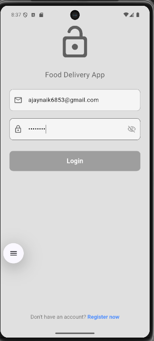
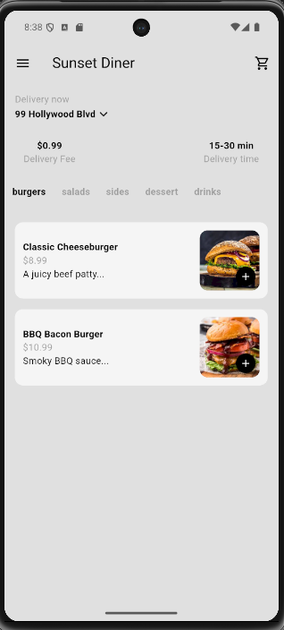
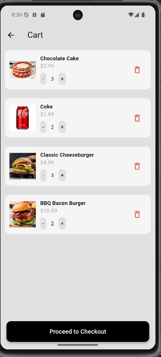
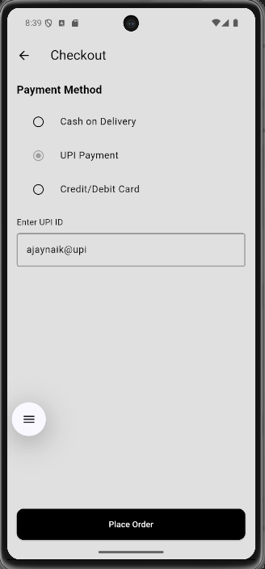
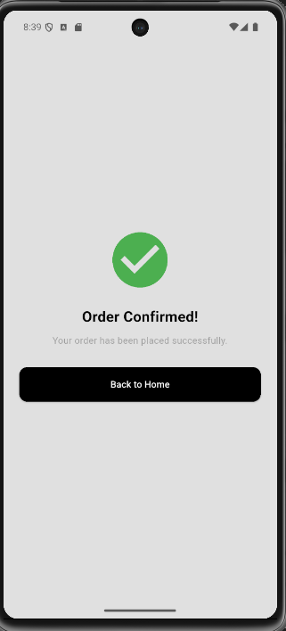

# 🍔 Food Delivery App

A full-featured food delivery mobile app built with Flutter and Firebase. Users can browse a restaurant menu, add items to cart, and place orders with multiple payment options.

## Features

- **Authentication** — Email/password Sign Up and Login via Firebase Auth
- **Menu Browsing** — Category-filtered menu (burgers, salads, sides, dessert, drinks) with item images, prices, and descriptions loaded from Firestore
- **Cart** — Add/remove items, adjust quantities, view running total
- **Address** — Set and update delivery address inline
- **Checkout** — Choose payment method (Cash on Delivery, UPI, Credit/Debit Card)
- **Order Confirmation** — Success screen on order placement

## Tech Stack

| Layer | Technology |
|---|---|
| Frontend | Flutter (Dart) |
| Authentication | Firebase Auth |
| Database | Cloud Firestore |
| State Management | setState / Provider |

## Screenshots

| Login | Menu | Cart | Checkout | Order Confirmed |
|---|---|---|---|---|
|  |  |  |  |  |

## Getting Started

### Prerequisites
- Flutter SDK (3.x+)
- Firebase project with Firestore and Authentication enabled

### Setup

1. Clone the repository
   ```bash
   git clone https://github.com/Ajay-Naik/restaurant_app.git
   cd restaurant_app
   ```

2. Install dependencies
   ```bash
   flutter pub get
   ```

3. Configure Firebase
   - Create a Firebase project at [console.firebase.google.com](https://console.firebase.google.com)
   - Enable Email/Password Authentication
   - Enable Cloud Firestore
   - Download `google-services.json` and place it in `android/app/`

4. Run the app
   ```bash
   flutter run
   ```

## Firestore Structure

```
menu (collection)
  └── {documentId}
        ├── name: "Classic Cheeseburger"
        ├── category: "burgers"
        ├── price: 8.99
        ├── desc: "A juicy beef patty..."
        └── image: "images/burger.png"
```

## Future Improvements

- Order history screen
- Real-time order tracking
- Admin panel for menu management
- Firebase Hosting deployment
- Push notifications on order status

## Author

**Ajay Naik** — [github.com/Ajay-Naik](https://github.com/Ajay-Naik) · [LinkedIn](https://www.linkedin.com/in/ajaynaik-dev/)
